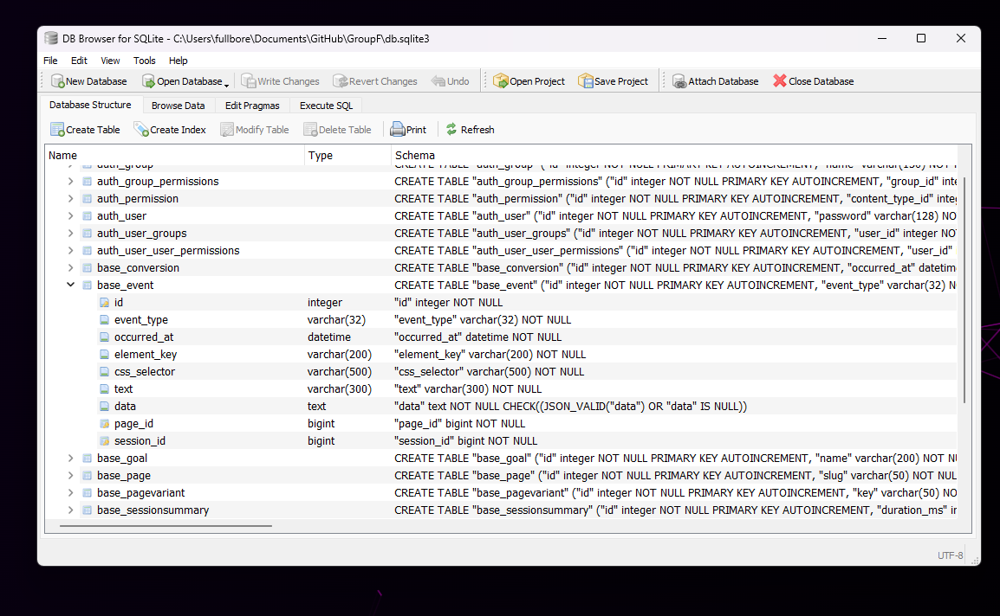

# Group F Project
"We may be group F but we are going for the A+"

todo:
- We need some branding!
- Identify other things we can track than clicks
- Study the database layout and see if we need to add / change things
- Dashboard and homepage where you pick a page to view are UGLY and plain, need some style

# Important Note

Note, the admin user is 
```bash
user: admin
pass: groupf
```

You can add users from /admin dashboard or via console:

```bash
python manage.py createsuperuser
```

# Web App Framework


## Getting started (Poetry)

1) Install Poetry

```bash
pip install poetry
```

2) Install project dependencies (run from project root where manage.py exists)

```bash
poetry install
```

3) Activate the virtual environment

```bash
poetry shell
```

4) Run database migrations ( I am checking in the db.sqlite so you don't have to do this unless you blow away the database and want a new one )

```bash
python manage.py makemigrations
python manage.py migrate
```

5) Start the development server

```bash
python manage.py runserver
```

Open in browser:
http://127.0.0.1:8000/

---

Database is simple right now, will grow as we discover more types of data to store:

```python
base/models.py

class Project(models.Model):  # The Table Name
    name = models.CharField(max_length=128)
```

---


# Bonus Database Stuff

If you want to get a visual way to browse the database, but only edit the DB using the python models

> https://sqlitebrowser.org/

