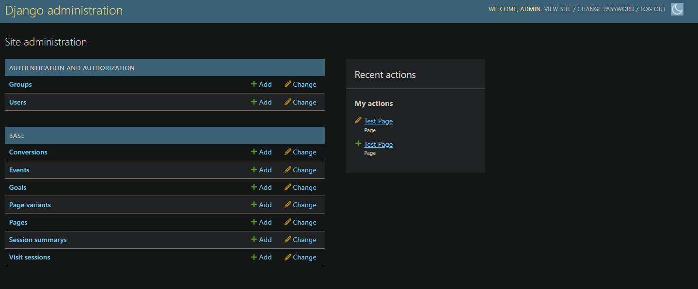
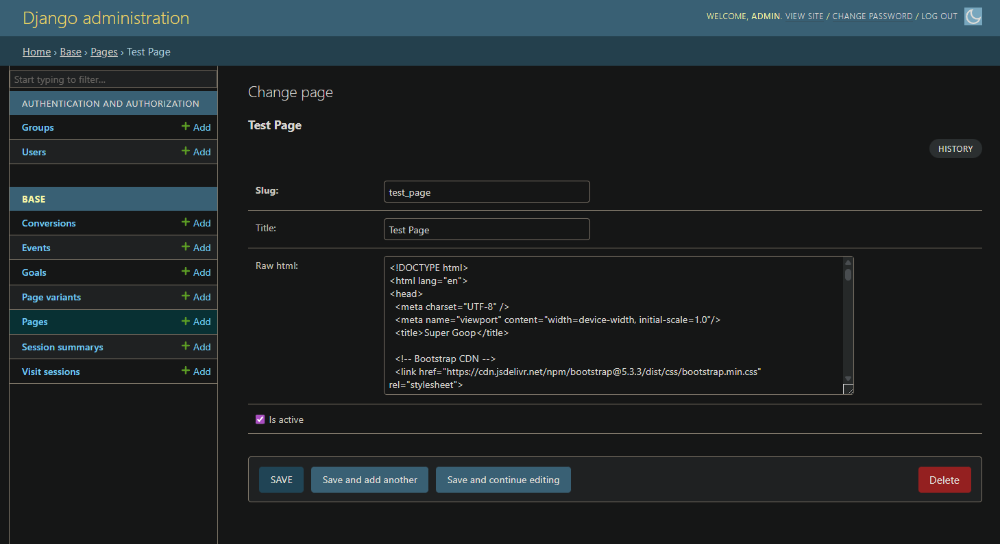
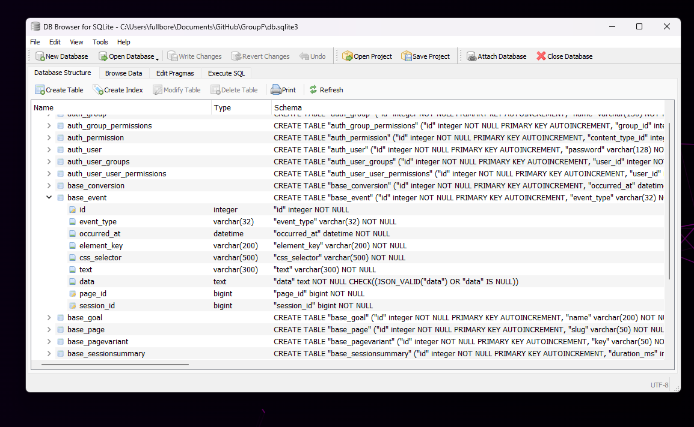

# Group F Project
"We may be group F but we are going for the A+"

## Using AI with the models

One easy way to get help from AI on this project is to point it at `base/models.py` and ask it to write queries, reports, or dashboards from the schema we already have.

Good prompt ideas:

```text
Look at base/models.py and write a Django ORM query that shows the most clicked elements per page in the last 7 days.
```

```text
Using the models in base/models.py, help me find sessions that reached 75% scroll depth and then clicked checkout.
```

```text
Read base/models.py and suggest a few useful analytics queries for Event, VisitSession, Goal, and Conversion.
```

```text
Based on base/models.py, write SQL and Django ORM examples for hover rate, scroll depth, and click-through analysis.
```

Best results usually come from asking AI to:

- read `base/models.py` first
- use Django ORM unless you specifically want SQL
- explain which model fields the query depends on
- give both a quick version and a more production-ready version if needed

## Summary of recent changes

Today we expanded the project from basic click tracking into a more complete interaction analytics prototype:

- added hover tracking through the existing event pipeline, saved as `Event.TYPE_CUSTOM` with `data.custom_type = "hover"`
- added throttled scroll tracking with milestone depth events at `10/25/50/75/90/100%`
- upgraded the page detail dashboard to show event mix, custom signals, top targets, recent activity, and scroll reach
- added a Chart.js interaction mix chart to the page detail dashboard
- refreshed the main dashboard so it highlights pages, top clicks, scroll leaders, and overall interaction volume
- added persistent dashboard navigation in the shared base template for easy jumps to `/` and `/dashboard/`
- dockerized the app with `Dockerfile`, `docker-compose.yml`, and an entrypoint that keeps using persisted `db.sqlite3`

todo:
- user could add notes to go with their session in a sticky header or footer or something and link to dashboard
  - (team) visual mockup
  - (team) optional html mockup
- We can add some live data to the bottom of the pages themselves ( meh.com style )
  - (team) visual mockup and/or data sets to use
  - (team) optional html mockup


# Important Notes

Note, the admin user is 
```bash
user: admin
pass: groupf
```

You can add users from /admin dashboard or via console:

```bash
python manage.py createsuperuser
```

## admin
Going to http://127.0.0.1:8000/admin/ lets you browse data in a raw format and create pages


You can create pages with raw html like this:
 


## What's working right now?
1. When you add a page in the admin you can then visit it from the home page
2. You can view pages in the dashboard and look at session stats (just cliks right now)
3. There is a view that collects tracked events and you can see them in the debug log while you run your webserver, they look like this:

```bash
[19/Feb/2026 18:43:42] "GET /pages/test_page/ HTTP/1.1" 200 5800
[19/Feb/2026 18:44:56] "POST /track/event/ HTTP/1.1" 200 12
[19/Feb/2026 18:44:56] "POST /track/event/ HTTP/1.1" 200 12
[19/Feb/2026 18:44:56] "POST /track/event/ HTTP/1.1" 200 12
[19/Feb/2026 18:44:57] "POST /track/event/ HTTP/1.1" 200 12
```

4. the "track_event" function and tracking models are pretty open ended where we can sends any kind of data we want, explore the base/models.py for some ideas

---

# Web App Framework

## Getting started (Poetry)

1) Install Django (make sure you have latest python installed)

```bash
pip install django
```


5) Start the development server

```bash
python manage.py runserver
```

Open in browser:
http://127.0.0.1:8000/

---

## Docker

Simple Docker setup keeps using SQLite, with the DB persisted in a Docker volume.
The container runs `gunicorn` and serves static files with `whitenoise`, so this is suitable for a basic server deploy.

Build and run:

```bash
docker compose up --build
```

Then open:
http://127.0.0.1:8020/

Notes:

- the container runs `python manage.py migrate` on startup
- the container runs `python manage.py collectstatic` on startup
- the checked-in `db.sqlite3` is copied into the persistent volume the first time the container starts
- later runs keep using the persisted SQLite file at `/app/data/db.sqlite3`
- compose now publishes the app on host port `8020`

To stop:

```bash
docker compose down
```

To remove the persisted SQLite volume too:

```bash
docker compose down -v
```

---

To run database migrations ( I am checking in the db.sqlite so you don't have to do this unless you blow away the database and want a new one )

```bash
python manage.py makemigrations
python manage.py migrate
```

---

Database is simple right now, will grow as we discover more types of data to store:

```python
base/models.py

class Project(models.Model):  # The Table Name
    name = models.CharField(max_length=128)
```

---


# Bonus Database Stuff

If you want to get a visual way to browse the database, but only edit the DB using the python models

> https://sqlitebrowser.org/


